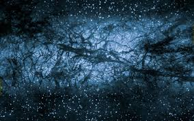
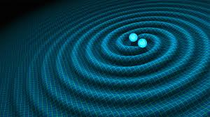
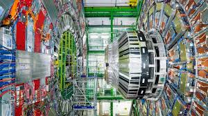
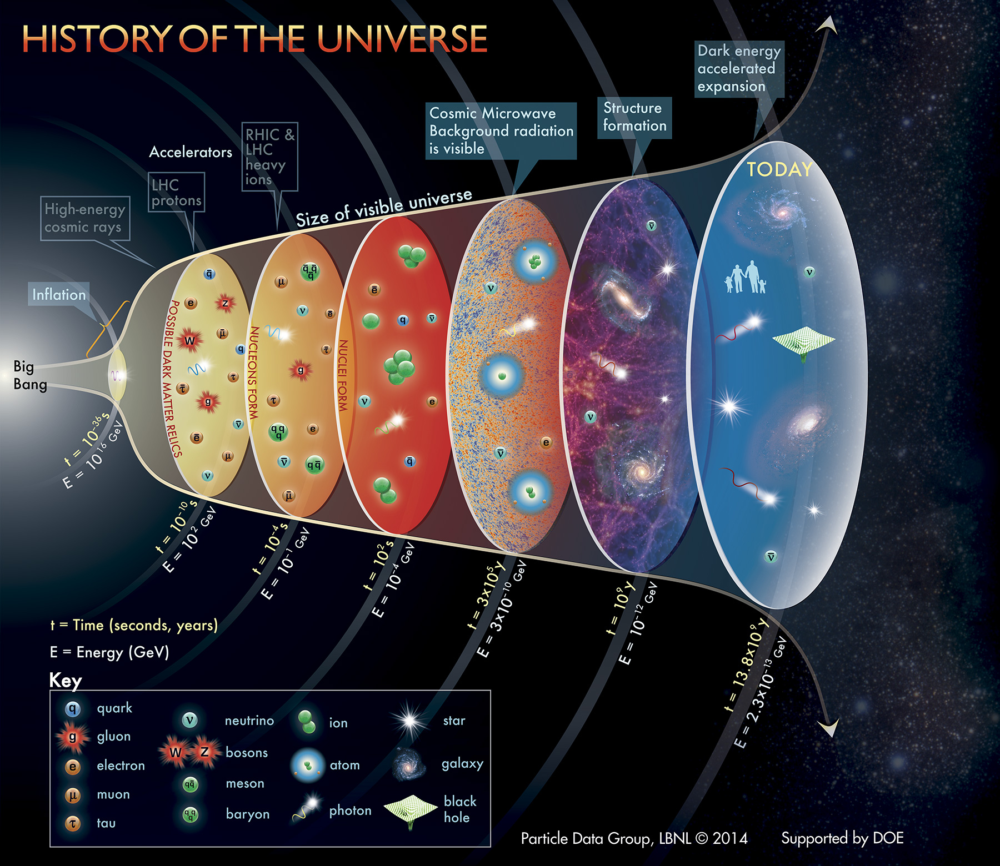

# TPPC Literature

Literature repository for TPPC PhD students. Updated after weekly meetings on Thursdays @ 11am in S7.27. Contains reviews and publications categorised by field and relevance. 

To submit literature, or be added to the repository, please contact me via [email](mailto:james.alvey@kcl.ac.uk).

Requests for literature suggestions can be made by submitting an issue with the supplied template.

Current Topics
---

## Dark Matter

- Direct/Indirect Detection
- Model Building
- Astroparticle Physics
- Collider searches
- Cosmological Implications
- Numerical Simulations

## Gravitational Waves

- Numerical Simulation
- Cosmology
- LIGO/LISA Detectors
- Sources
- Electromagnetic Couterparts
- Modified Gravity

## Collider Physics

- Standard Model Precision Physics
- Supersymmetry
- Dark Matter
- Long-lived Particles Theory and Detectors (e.g. Faser)
- ATLAS/CMS

## Cosmology

- Big Bang Nucleosynthesis
- Cosmic Microwave Background
- 21cm Physics
- Inflation
- Gravitational Waves
- Experiments

## Machine Learning

- Deep Learning
- Architectures
- Jet Physics
- Cosmology
- Adversarial Networks

